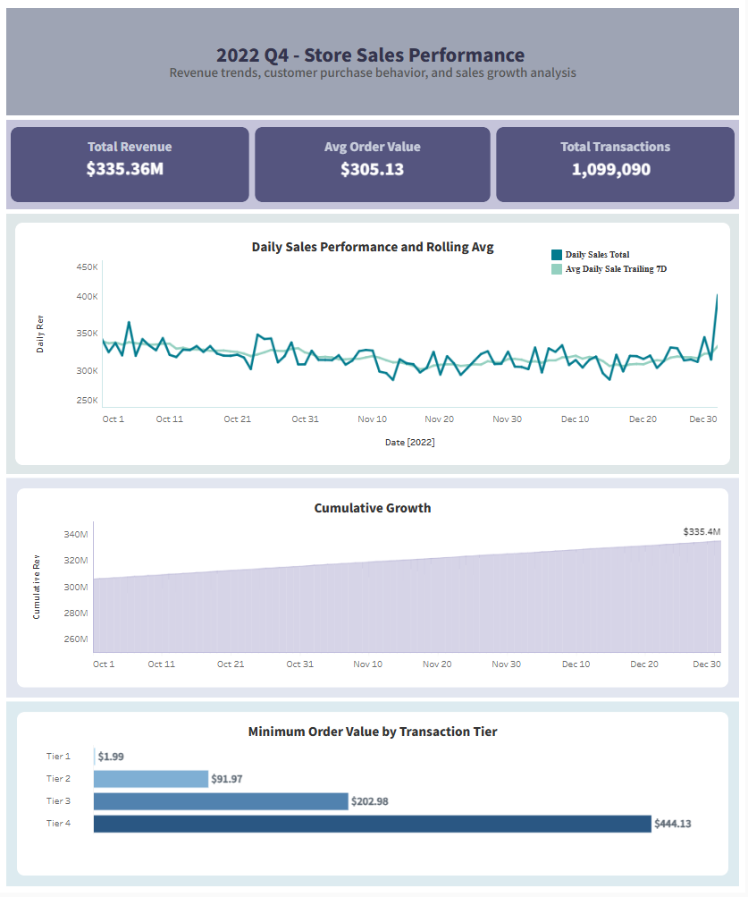

# 🛒 Store Sales Analysis (SQL Project)

## 📌 Overview

This project analyzes retail transaction data using SQL to evaluate sales performance, transaction behavior, and revenue trends over time. It demonstrates how raw transactional data can be transformed into actionable insights using joins, window functions, and time-series analysis.

---

## 🗂️ Dataset

The project is built on three relational tables:

* **transactions** – transaction-level data (date, customer, items per transaction)
* **transaction_items** – links products to transactions
* **products** – product details including price and category

---

## ⚙️ Key Techniques Used

* Common Table Expressions (CTEs)
* Window Functions:

  * `ROW_NUMBER`
  * `NTILE`
  * `AVG() OVER`
  * `SUM() OVER`
* Aggregations (`SUM`, `AVG`, `MIN`, `MAX`)
* Multi-table joins
* Rolling window calculations
* Date manipulation (MySQL functions)

---

## 📊 Key Analyses

### 1. Transaction Behavior

* Identified repeat transactions per customer per day using `ROW_NUMBER`
* Compared transaction sizes using ranking functions (`RANK`, `DENSE_RANK`)

---

### 2. Sales Distribution (Quartile Analysis)

* Calculated total sales per transaction using joined product pricing
* Segmented transactions into quartiles using `NTILE(4)`
* Derived minimum sales thresholds for each quartile:

| Quartile | Min Transaction Value |
| -------- | --------------------- |
| Q1       | ~$1.99                |
| Q2       | ~$91.97               |
| Q3       | ~$202.98              |
| Q4       | ~$444.13              |

---

### 3. Sales Summary Metrics

* Average transaction value
* Minimum and maximum transaction sales
* Pivoted quartile thresholds into a single summary output using `CASE WHEN`

---

### 4. Sales Trends Over Time (Time-Series Analysis)

Built a daily sales dataset and applied window functions to analyze trends:

* **Daily Sales Aggregation**

  * Total revenue per day

* **Running Total Revenue**

  * Tracks cumulative sales growth over time

  ```sql
  SUM(daily_sales_total) OVER (ORDER BY trans_dt)
  ```

* **7-Day Trailing Average**

  * Smooths volatility and highlights trends

  ```sql
  AVG(daily_sales_total) OVER (
      ORDER BY trans_dt 
      ROWS BETWEEN 6 PRECEDING AND CURRENT ROW
  )
  ```

---

## 📅 Date Manipulation

Implemented MySQL date functions to replicate common analytics patterns:

* Add time intervals:

  ```sql
  trans_dt + INTERVAL 1 DAY
  trans_dt + INTERVAL 1 MONTH
  ```

* Extract date parts:

  ```sql
  DAY(trans_dt), MONTH(trans_dt), YEAR(trans_dt)
  ```

* Simulate `DATE_TRUNC`:

  ```sql
  DATE_FORMAT(trans_dt, '%Y-%m-01')
  ```

---

## 📈 Example Outputs

This project produces the following analytical outputs:

- **Sales Summary Metrics**  
  → `full_stats_summary.csv`

- **Daily Sales Trends (Running Total + 7-Day Avg)**  
  → `daily_sales_trend.csv`

These outputs demonstrate transaction distribution, revenue growth, and smoothed sales trends over time.

---

## 🚀 How to Run

1. Create database:

```sql
CREATE DATABASE store_project;
USE store_project;
```

2. Run table creation + data import scripts

3. Execute analysis queries:

   * Window functions
   * Quartile analysis
   * Sales trend analysis

---

## 💡 Key Takeaways

* Window functions enable powerful time-series and ranking analysis
* Quartile segmentation helps identify high-value transactions
* Running totals and rolling averages reveal trends more effectively than raw data
* Proper joins are critical for accurate revenue calculations

---

## 🛠️ Tools Used

* MySQL
* SQL (CTEs, window functions, aggregations)

---
## 📊 Tableau Dashboard

Interactive Tableau dashboard:

[View Dashboard on Tableau Public](https://public.tableau.com/views/yourdashboard)

### Dashboard Preview



## 📌 Future Improvements

* Add customer-level segmentation
* Analyze product/category performance

---

## 👤 Author

Nicole Doan
